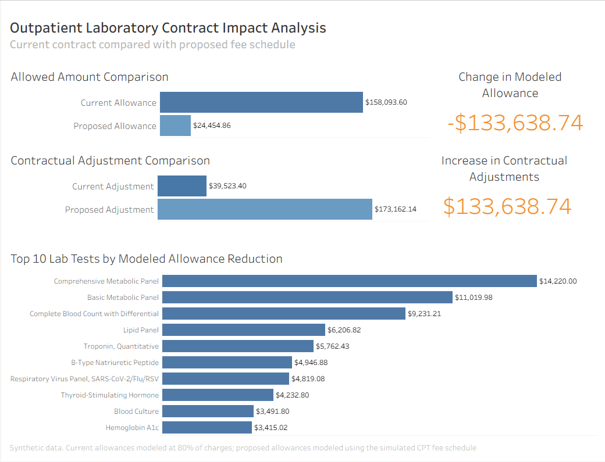

# Outpatient Laboratory Contract Analysis

## Project Overview

This project compares a hospital’s current outpatient laboratory contract with a proposed fee schedule. The analysis models how the proposed schedule would affect allowed amounts and contractual adjustments while holding charge volume constant.

## Business Question

How would replacing the current outpatient laboratory contract with the proposed fee schedule affect modeled reimbursement and contractual adjustments?

## Tools

- DuckDB SQL
- Jupyter Notebook
- Markdown
- Synthetic CSV datasets
- Tableau

## Methodology

- Profiled and validated four related source datasets.
- Confirmed unique row identifiers, required values, and valid foreign-key relationships.
- Used net quantity to account for charge reversals and corrections.
- Joined patient encounters, patient charges, the laboratory charge master, and the proposed fee schedule.
- Calculated current allowances at 80% of charges.
- Applied the proposed fee schedule by CPT code.
- Compared results at the individual-charge, charge-code, and overall levels.
- Reconciled allowed-amount differences to contractual-adjustment differences.

## Key Findings

- The current contract produced a modeled allowed amount of **\$158,093.60**.
- The proposed fee schedule produced a modeled allowed amount of **\$24,454.86**.
- The proposed fee schedule reduced modeled allowances by **\$133,638.74**.
- No laboratory test had a higher modeled allowance under the proposed fee schedule.
- The largest modeled reductions were associated with **Comprehensive Metabolic Panel, Basic Metabolic Panel, and Complete Blood Count with Differential**.

## Data Disclaimer

This project uses synthetic data created solely to demonstrate source validation, relational data modeling, SQL analysis, and healthcare reimbursement modeling. It does not contain or represent real patients, encounters, charges, or reimbursement information.

Modeled allowed amounts do not necessarily represent collected revenue. The analysis does not account for claim denials, patient responsibility, coordination of benefits, collection rates, or payer-specific adjudication rules.

## Project Files

- [Read the complete Markdown analysis](<Lab Revenue Comparison.md>)
- [View the Jupyter notebook](<Lab Revenue Comparison.ipynb>)
- [View the synthetic source data](<Lab Contract Review>)

## Tableau Dashboard

[View the interactive Tableau dashboard](https://public.tableau.com/views/OPLabContractImpact/OPLabContractAnalysis)

